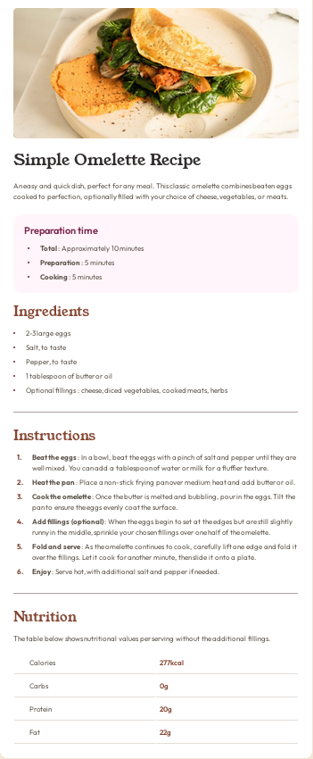

# Frontend Mentor - Recipe page solution

This is a solution to the [Recipe page challenge on Frontend Mentor](https://www.frontendmentor.io/challenges/recipe-page-KiTsR8QQKm). Frontend Mentor challenges help you improve your coding skills by building realistic projects.

## Table of contents

- [Overview](#overview)
  - [The challenge](#the-challenge)
  - [Screenshot](#screenshot)
  - [Links](#links)
- [My process](#my-process)
  - [Built with](#built-with)
  - [What I learned](#what-i-learned)
- [Author](#author)

## Overview

### Screenshot



### Links

- Solution URL: [https://github.com/mickael-o3o/recipe-page-solution.git](https://github.com/mickael-o3o/recipe-page-solution.git)
- Live Site URL: [live site URL](https://mickael-o3o.github.io/recipe-page-solution)

## My process

### Built with

- [Vue](https://vuejs.org)
- [Sass](https://sass-lang.com)
- Mobile-first workflow

### What I learned

Use counters to create custom list markers.

```sass
&-list {
    @include mixins.list;
    counter-reset: li;

    li {
      padding-left: 2.625rem;
      position: relative;

      &::before {
        content: counter(li) '.';
        counter-increment: li;
        color: var(--color-brown-800);
        font-weight: 700;
        display: inline;
        position: absolute;
        top: 0.5rem;
        left: 0.5rem;
        translate: 0 -0.5rem;
      }
    }
  }
```

### Continued development

Next time I'll create variables to store spacings so tweaking theme will be easier.

## Author

- Frontend Mentor - [@mickael-o3o](https://www.frontendmentor.io/profile/mickael-o3o)
